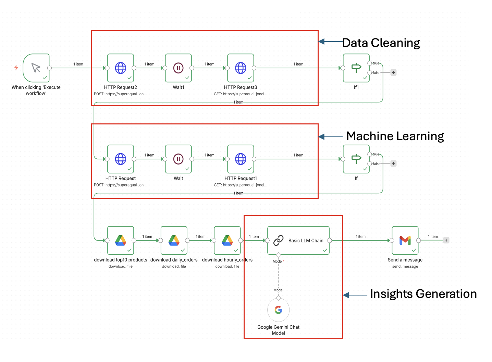
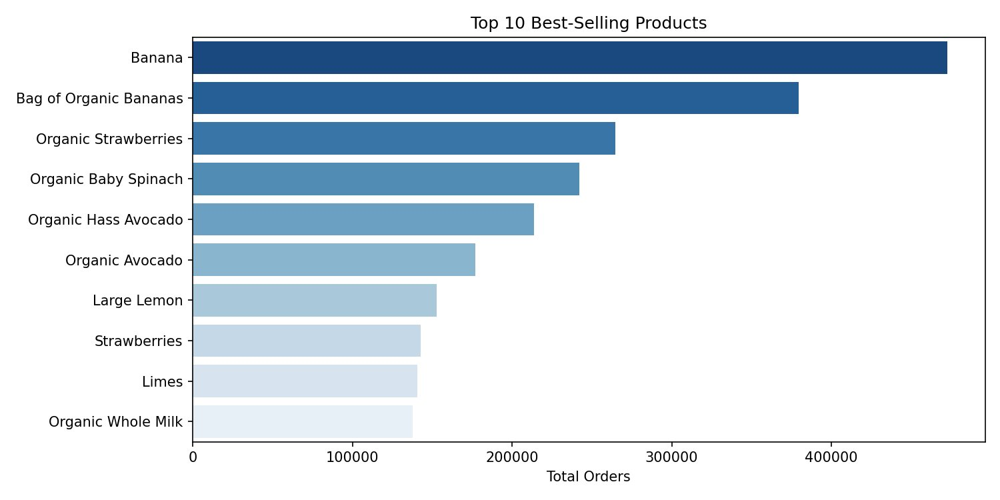
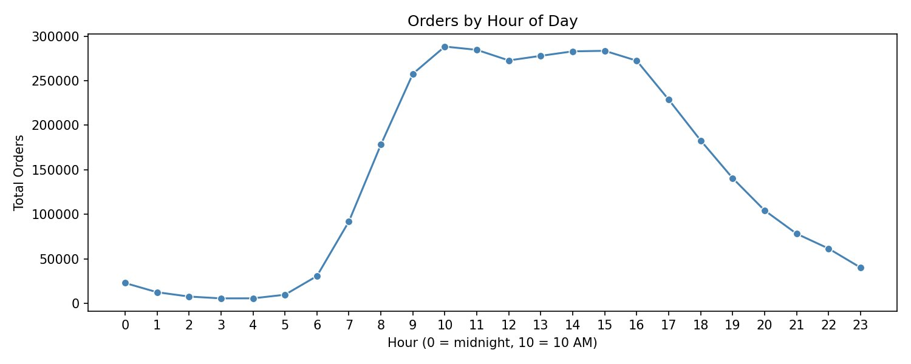
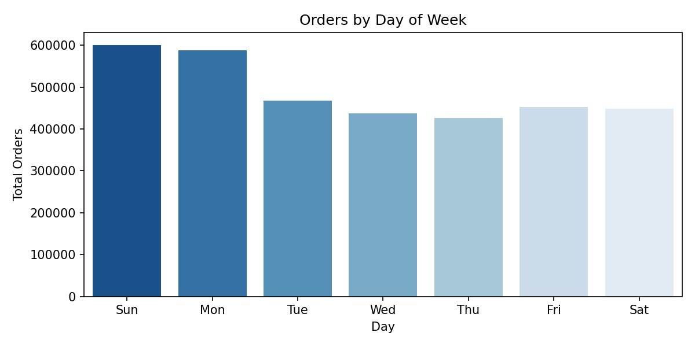
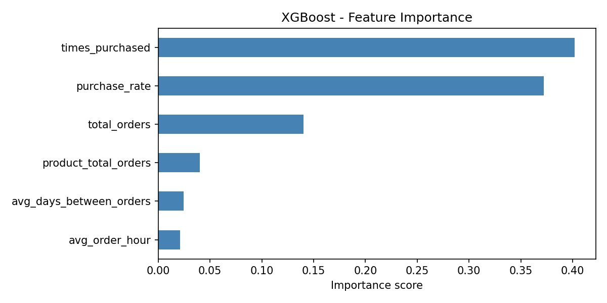
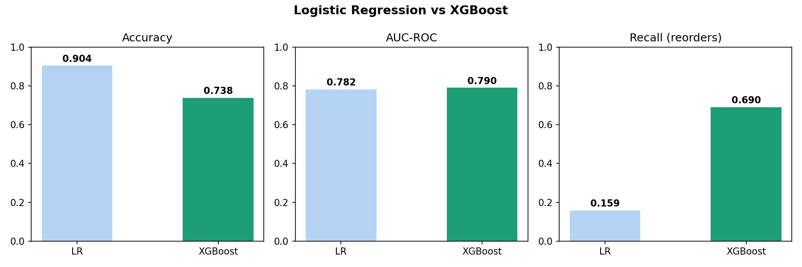

<div align="center">

# AI-Powered Retail Analytics & Inventory Optimization

### End-to-end machine learning pipeline for grocery retail — from 32M raw transactions to automated weekly insights

[](https://python.org)
[](https://xgboost.readthedocs.io)
[](https://n8n.io)
[](https://powerbi.microsoft.com)
[](https://colab.research.google.com)
[](https://ai.google.dev)

<br/>

<br/>

| 🎯 AUC-ROC | 📦 Reorder Recall | 🏆 Top Product | ⚡ Runtime |
|:---:|:---:|:---:|:---:|
| **0.790** | **69.0%** | Banana (472K orders) | **< 20 min** |

</div>

---

# 🛒 AI-Powered Retail Analytics & Inventory Optimization

An end-to-end automated retail analytics pipeline that ingests 32M+ transaction records, trains an XGBoost reorder classifier, scores inventory priority, and delivers AI-generated insights via automated Gmail — all triggered by a single n8n button click in under 20 minutes.

---

## 📋 Table of Contents

- [Business Problem](#-business-problem)
- [Key Results](#-key-results)
- [Architecture](#-architecture)
- [Project Structure](#-project-structure)
- [Quick Start](#-quick-start)
- [Pipeline Overview](#-pipeline-overview)
- [Results & Charts](#-results--charts)
- [Model Performance](#-model-performance)
- [Future Enhancements](#-future-enhancements)
- [References](#-references)

---

## Overview

A mid-sized grocery retailer was spending **3–4 hours every week** manually exporting CSVs, analysing data in Excel, and emailing summaries — with zero predictive capability and reactive inventory management.

This project replaces that process entirely. Raw transaction data from the **Instacart Online Grocery Shopping Dataset** (32M+ order-product records) is ingested, cleaned, and fed into an XGBoost classifier that predicts customer reorder behaviour. Results are scored into inventory priority tiers and delivered automatically as a Power BI dashboard and an AI-generated Gmail report.

**One button click. Under 20 minutes. Every week.**

---

## Business Questions

| # | Question | Output |
|---|----------|--------|
| **Q1** | Which products sell the most? | `top_products_latest.csv` + Power BI chart |
| **Q2** | Which products will customers buy again? | `reorder_predictions_latest.csv` + email top 5 |
| **Q3** | When do customers shop the most? | Hourly & daily charts in email + Power BI |
| **Q4** | How should stores manage inventory? | `inventory_priority_latest.csv` + High / Medium / Low tiers |

---

## Tech Stack

| Layer | Tool | Purpose |
|-------|------|---------|
| **Compute** | Google Colab | ML training & data processing |
| **Storage** | Google Drive | Raw data, cleaned CSVs, model outputs |
| **ML** | XGBoost + scikit-learn | Reorder prediction classifier |
| **Orchestration** | n8n | End-to-end workflow automation |
| **Tunnel** | Flask + ngrok | Expose Colab endpoints to n8n |
| **Dashboard** | Power BI | Interactive 4-question business dashboard |
| **AI Insights** | Google Gemini | Auto-generated action bullet summaries |
| **Delivery** | Gmail (OAuth) | Automated HTML report with charts |

---

## Architecture

```
┌──────────────────────────────────────────────────────────────┐
│               Retail Dataset (CSV / Google Drive)             │
└─────────────────────────────┬────────────────────────────────┘
                               │
                               ▼
┌──────────────────────────────────────────────────────────────┐
│                      n8n Trigger Node                         │
│                  Manual Trigger / Schedule                    │
└─────────────────────────────┬────────────────────────────────┘
                               │
                               ▼
┌──────────────────────────────────────────────────────────────┐
│                       Data Fetch Node                         │
│         HTTP POST → Flask/ngrok → Google Colab               │
│            Async: returns {status:"started"} in <1s           │
└─────────────────────────────┬────────────────────────────────┘
                               │
                               ▼
┌──────────────────────────────────────────────────────────────┐
│                   Execute Python Script                       │
│                      Data Cleaning                            │
│           Universal 8-step pipeline on all CSVs              │
└─────────────────────────────┬────────────────────────────────┘
                               │
                               ▼
┌──────────────────────────────────────────────────────────────┐
│                    Feature Engineering                        │
│                    Create ML Features                         │
│          6 leakage-free features from order history          │
└─────────────────────────────┬────────────────────────────────┘
                               │
                               ▼
┌──────────────────────────────────────────────────────────────┐
│                  Machine Learning Model                       │
│              Demand / Reorder Prediction                      │
│         XGBoost — AUC-ROC 0.790, Recall 69%                  │
└─────────────────────────────┬────────────────────────────────┘
                               │
                               ▼
┌──────────────────────────────────────────────────────────────┐
│                     Prediction Output                         │
│                   Forecasts & Insights                        │
│    reorder_predictions_latest.csv + inventory scores         │
└─────────────────────────────┬────────────────────────────────┘
                               │
                               ▼
┌──────────────────────────────────────────────────────────────┐
│                       Data Storage                            │
│                    CSV / Google Drive                         │
│          Dated + _latest versions saved each run             │
└─────────────────────────────┬────────────────────────────────┘
                               │
                               ▼
┌──────────────────────────────────────────────────────────────┐
│                  Power BI Dataset Refresh                     │
│        Connects directly to Google Drive CSV outputs         │
└─────────────────────────────┬────────────────────────────────┘
                               │
                               ▼
┌──────────────────────────────────────────────────────────────┐
│                    Insight Generation                         │
│           Google Gemini API — 4 action bullets               │
└─────────────────────────────┬────────────────────────────────┘
                               │
                               ▼
┌──────────────────────────────────────────────────────────────┐
│                  Notification / Reporting                     │
│         Automated Gmail — HTML report + charts               │
└──────────────────────────────────────────────────────────────┘
```

---

## Project Structure

```
AI-Powered-Retail-Analytics/
│
├── README.md
│
├── ML code/
│   └── Retail_Pipeline_Combined_v2.ipynb   ← Combined cleaning + ML notebook
│
├── docs/
│   ├── Final_Report_Complete.docx          ← IEEE-format project report
│   └── AI-Powered-Retail-Analytics.pptx   ← Project presentation deck
│
├── n8n/
│   └── workflow_export.json               ← Import directly into n8n
│
├── PowerBI_report/
│   └── RetailAnalytics_Dashboard.pdf      ← Power BI dashboard export
│
└── outputs/
    └── charts/
        ├── top10_products.png
        ├── hourly_orders.png
        ├── daily_orders.png
        ├── feature_importance.png
        └── model_comparison.png
```

> **Dataset:** Raw CSVs (~700 MB) are not included. Download the [Instacart Online Grocery Shopping Dataset](https://www.kaggle.com/c/instacart-market-basket-analysis) from Kaggle and place all files inside `Retail_Pipeline/Raw_Data/` on your Google Drive.

---

## Quick Start

### Prerequisites

- Google Account (Colab + Drive + Gmail)
- [ngrok](https://ngrok.com) account — free tier
- [n8n](https://n8n.io) account — cloud or self-hosted
- Power BI Desktop — free download

### Step 1 — Prepare Google Drive

Create the following folder structure in your Google Drive. The pipeline auto-creates the output folders on first run.

```
MyDrive/
└── Retail_Pipeline/
    └── Raw_Data/        ← Place all Instacart CSVs here
```

### Step 2 — Run the Colab Notebook

```
1. Open  ML code/Retail_Pipeline_Combined_v2.ipynb  in Google Colab
2. Run ALL cells top-to-bottom  (Cell 1 → Cell 7)
3. Copy the ngrok URL printed at the end of Cell 6
4. Keep the Colab tab open — closing it stops the server
```

### Step 3 — Configure n8n

```
1. Import  n8n/workflow_export.json  into your n8n instance
2. Paste the ngrok base URL into all four HTTP Request nodes
3. Connect Gmail via OAuth 2.0 in n8n credentials
4. Add your Google Gemini API key in n8n credentials
```


### Step 4 — Run

Click the **Manual Trigger** in n8n. The full pipeline completes in ~20 minutes and delivers results to Gmail automatically.

---

## Pipeline Details

### Data Cleaning

A universal 8-step cleaning pipeline auto-discovers and processes every CSV in `Raw_Data/` — no filenames are hardcoded.

| Step | Action |
|:----:|--------|
| 1 | Standardise column names — lowercase with underscores |
| 2 | Strip leading/trailing whitespace from all text fields |
| 3 | Drop fully empty rows |
| 4 | Remove exact duplicate rows |
| 5 | Composite key deduplication on `(order_id, product_id)` |
| 6 | Range validation — `order_dow` 0–6, `order_hour` 0–23, `reordered` 0/1 |
| 7 | Fill nulls with 0 — except `days_since_prior_order` (null = valid first order) |
| 8 | IQR × 1.5 outlier removal on ML feature columns only |

### Feature Engineering

A **leakage-free train/future split** is applied first: each user's last order (by `order_number`) becomes the prediction target; all prior orders form the training history. Six features are engineered from history only.

| Feature | Importance | Description |
|---------|:----------:|-------------|
| `times_purchased` | **40%** | Number of times this user ordered this product |
| `purchase_rate` | **37%** | `times_purchased / (total_orders + 1)` |
| `total_orders` | 14% | Total historical orders placed by this user |
| `product_total_orders` | 4% | Total orders for this product across all users |
| `avg_days_between_orders` | 3% | Mean days between the user's consecutive orders |
| `avg_order_hour` | 2% | Mean hour of day the user shops |

### Inventory Scoring

Each product (with ≥ 100 orders) receives a weighted priority score:

```
final_priority = 0.4 × demand_norm + 0.3 × reorder_rate + 0.3 × avg_reorder_prob
```

| Tier | Score Range | Products |
|------|:-----------:|:--------:|
| 🔴 High | 0.66 – 1.00 | 2 |
| 🟡 Medium | 0.33 – 0.66 | 1,895 |
| 🟢 Low | 0.00 – 0.33 | 18,170 |

---

## Results

### Q1 — Top 10 Best-Selling Products

All top 10 products are fresh produce. Banana leads with **472,565 total orders** — 1.3× ahead of third place. Only Banana (0.88) and Bag of Organic Bananas (0.79) reach the High inventory tier.



---

### Q3 — Peak Shopping Times

Orders peak sharply at **10 AM** (~290,000 orders) and remain elevated through 3 PM. Volume drops off steeply after 8 PM. Shelves should be fully stocked before 9 AM.



**Sunday (~600K) and Monday (~590K)** are the two busiest days — together accounting for over 30% of weekly volume. Mid-week orders are consistently lower.



---

### Q2 — Feature Importance

`times_purchased` and `purchase_rate` together account for **77% of model importance**, confirming that individual purchase history is the dominant signal for reorder prediction.



---

## Model Performance

XGBoost was selected over Logistic Regression as the production model. While LR achieves 90.4% accuracy, it does so by predicting *non-reorder* for almost every case — making it practically useless for inventory management. XGBoost correctly identifies **69% of actual future reorders**, enabling proactive restocking before stockouts occur.



| Metric | Logistic Regression | XGBoost |
|--------|:-------------------:|:-------:|
| Accuracy | 0.904 ⚠️ | 0.738 |
| AUC-ROC | 0.782 | **0.790** ✅ |
| Recall (reorders) | 0.159 | **0.690** ✅ |

> LR's high accuracy is misleading — it predicts non-reorder for ~90% of cases, which matches the class distribution but catches almost no actual reorders. Recall is the metric that matters here.

---

## Future Enhancements

- **Cloud deployment** — migrate Flask pipeline to Google Cloud Run or Railway.app to eliminate manual Colab session management
- **Scheduled automation** — replace manual n8n trigger with a Sunday 6 AM cron schedule for fully hands-off weekly runs
- **Advanced modelling** — explore LSTM or transformer architectures for sequential purchase pattern detection, especially for seasonal products
- **Multi-store support** — extend the pipeline to partition and score data across multiple retail locations

---

## References

1. N. Hozyfas et al., "Integration of ML and Advanced Computing for Retail Analytics," *Int. J. Business and Economics Insights*, vol. 2, no. 3, 2022.
2. T. Chen & C. Guestrin, "XGBoost: A Scalable Tree Boosting System," *KDD*, 2016. [arXiv:1603.02754](https://arxiv.org/abs/1603.02754)
3. Microsoft, [Power BI Documentation](https://docs.microsoft.com/power-bi), 2024.
4. n8n, [Workflow Automation Documentation](https://docs.n8n.io), 2024.
5. Google, [Gemini API Documentation](https://ai.google.dev/docs), 2024.
6. Instacart, [Online Grocery Shopping Dataset 2017](https://www.kaggle.com/c/instacart-market-basket-analysis), Kaggle, 2017.
7. P. Geurts, D. Ernst & L. Wehenkel, "Extremely Randomized Trees," *Machine Learning*, vol. 63, pp. 3–42, 2006.

---

<div align="center">
<sub>Built with Python · XGBoost · n8n · Google Colab · Power BI · Google Gemini</sub>
</div>
